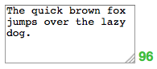

DecodeMTL jQuery Textbox Counter Workshop
=========================================

This workshop is designed to get you familiar with [jQuery](http://www.jquery.com), a JavaScript library that makes it easy to manipulate elements on a web page.

If you are looking at this workshop, it's either because you already finished the exercises/activities for the day, or are looking for something to do in the weekend until the next class. Since it is extra work, this workshop will be our lowest priority when dealing with help requests.

That being said, you are definitely not alone in your quest to complete the workshop. The online [jQuery documentation](https://api.jquery.com/) is full of code examples to get you started.

The following sections of the documentation will be particularly useful while working on this workshop:

* [jQuery Keyboard Events Documentation](https://api.jquery.com/category/events/keyboard-events/)
* [jQuery Preventing Event Default](https://api.jquery.com/event.preventDefault/)
* [jQuery `.text()` Documentation](https://api.jquery.com/text/)

The above documentation links are by no means the only ones you will be looking at. [Google](http://www.google.com), [StackOverflow](http://www.stackoverflow.com) and [Mozilla Developer Network](https://developer.mozilla.org/) are all great resources where you can learn about HTML, CSS, JavaScript and more.

Goal of the workshop
--------------------
The goal of this workshop is to learn to use jQuery to attach a character limit counter to an [HTML `<textarea>` element](https://developer.mozilla.org/en-US/docs/Web/HTML/Element/textarea). We will go about it **slowly, step by step**.

The end result will look something like the following screenshot. Feel free to customize the CSS even if it's not part of the workshop content ;)

---



---

Step 1: Setting up
------------------
Create a new blank project using your favourite IDE. For most of you this will be the Cloud9 IDE. In this project, create an HTML file called `index.html` with the following content:

```html
<!DOCTYPE html>
<html>
  <head>
    <meta charset="utf-8">
    <title>DecodeMTL jQuery Textbox Workshop</title>
  </head>
  <body>
    <div>
      <textarea id="the-textarea"></textarea>
      <span id="character-counter"></span>
    </div>

    <script src="https://code.jquery.com/jquery-1.12.0.js"></script>
    <script src="workshop.js"></script>
  </body>
</html>
```

In addition to the base HTML structure, we are setting up a `<div>` (generic block-level container) with a `<textarea>` and a `<span>` (generic inline container).

We are also setting up the page to load the jQuery library, as well as a script called `workshop.js`. Create an empty file called `workshop.js` and move on to step 2.

Step 2: Getting started!
------------------------
From now on we will be spending most of our time in the `workshop.js` file.

For this step, you will be setting up a [`keyup` event handler](https://api.jquery.com/keyup/) on the `textarea`.

Whenever the `keyup` event is triggered, your handler function should `log` the number of characters in the `textarea` in the [browser's console](https://developers.google.com/web/tools/chrome-devtools/debug/console/console-ui?hl=en).

In addition to the linked documentation, you will also need to [find the `textarea`'s current value](https://api.jquery.com/val/) and then [find the character length of that string](https://developer.mozilla.org/en-US/docs/Web/JavaScript/Reference/Global_Objects/String/length)

Step 3: Visual feedback
-----------------------
In the previous step, we were outputting the current character length of our `textarea` in the browser's console. This is something we often do when getting started with a new feature. It's an easy way to check that we have the correct value before using it in a more "complicated" context.

In this step, we are going to be using the text length value from step two. But instead of displaying it in the browser's console, we will be [changing the text inside the `span`](https://api.jquery.com/text/) to the number of characters.

Step 4: Customizing
-------------------
Up until now, our code is only telling the user how many characters they typed in the `textarea`. In this step, we will set a character limit on the `textarea` and then use this limit to display the **remaining number of characters** instead.

Modify your `index.html` to add a `maxlength` attribute on your `textarea` element. The `maxlength` attribute only works as of HTML5, but all modern browsers should support it. Set the maximum length to 140 characters, the length of a tweet. Adding this attribute to your `textarea` will block the user if they try to enter more than the character limit.

Next, modify your jQuery code to display the **remaining character count** in the `span`.

**NOTE**: Make sure your JavaScript code does not hardcode the 140 characters value. Instead you should try to [find out the `maxlength` attribute of the textarea](https://api.jquery.com/attr/). This way if you later change the maxlength, your counter will still work appropriately.

For bonus points, make it so that the character count display is:

* Green if more than 20% of characters are left
* Gold/yellow if between 10% and 20% of characters are left
* Red if less than 10% of characters are left

One simple way to achieve this colour change is to [modify the `class` of the `span` element](https://api.jquery.com/addclass/) and use some CSS to colour the text appropriately.

Step 5: Getting rid of rough edges
----------------------------------
Notice that before you start writing anything in the textarea, there is no character count displayed. Your code only starts displaying when the first input is received from the user.

Modify your code so that the initial remaining character count is displayed as soon as the page loads.


What to do next?
================
Finishing this workshop should have given you a pretty good understanding of the fundamentals of jQuery. jQuery is extremely helpful when comes the time to manipulate the DOM of our web page. However, it turns out that jQuery does not scale very well to a more complex application full of interactions and components.

One of the many UI frameworks out there that aims to solve these maintainability and scalability issues is [Facebook's React](http://facebook.github.io/react/). React is a beast: not only is it not easy to get started with it, it's not immediately straightforward why it can be superior.

[This ReactJS introduction tutorial](http://reactfordesigners.com/labs/reactjs-introduction-for-people-who-know-just-enough-jquery-to-get-by/) is made specifically for developers like yourself who, as the author says, *"only know enough jQuery to get by"*. Following this tutorial will expand on the workshop you finished, and will give you a good introduction to the subject.
